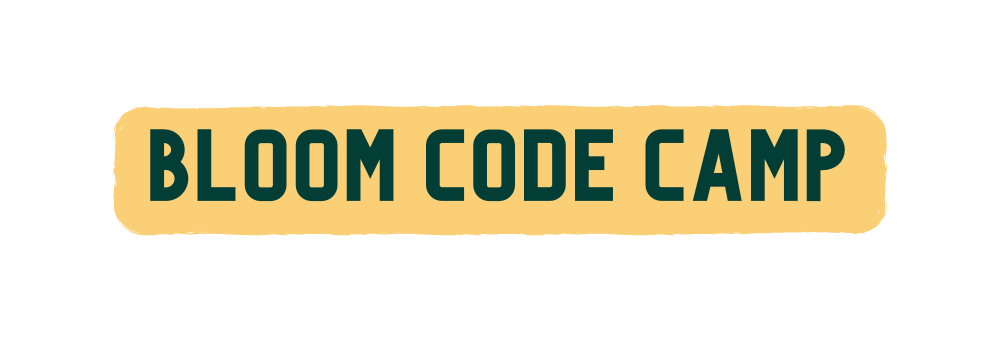
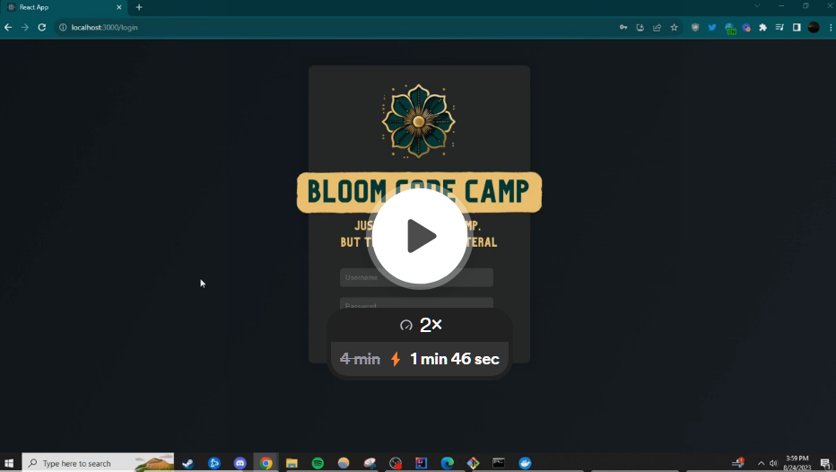

## Introduction
BloomCodeCamp makes it easy to for coding bootcamps to manage assignment submission by students, and assginment feedback by reviewers.
To see it in action see the video below:

## Key Features
- 🔐 **Secure Log-In System**: Differentiated user roles for students and reviewers.
- 📝 **Assignment Submissions**: Students can effortlessly submit assignments for review.
- 🚀 **Real-time Feedback**: Students receive timely feedback from reviewers.
- ✅ **Comprehensive Status**: Track assignments as they're reviewed, accepted, or rejected.

## Tech Stack
- **Backend**: Springboot and Spring Data JPA with Hibernate
- **Database**: PostgreSQL
- **Frontend**: ReactJS
- **Authentication**: Spring Security with JWT

## To get started
To set this project up you will need to clone it to your local computer and make sure to have the pre-requisits of...
- docker / dockerdesktop
- docker compose
- intellij Idea
- Java JRE and JDK 17+

### Make sure you are in the root directory...
1. Read the `docker-compose.yml` file and change any ports that you need to based on your local setup
2. Run `docker-compose up`
3. Open the project inside intellij
4. Go to the `application.properties` file and follow the instructions to make your dev profile.
5. look over the code base and familiarize yourself with [spring boot docs](https://docs.spring.io/spring-boot/docs/current/reference/htmlsingle/). 
3. Run the `BackendApplication`
4. Visit `http://localhost:8080/` or localhost at a port you chose if you changed any ports in the `application-dev.properties` file.

**To get an overview of the actual application proposal you can find the docs [here](documents/composition_document.md)**
